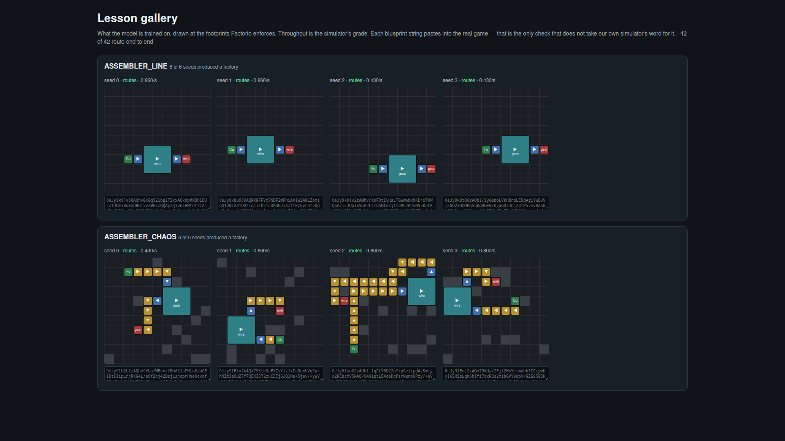

# Roadmap & bottlenecks

The issue asks specifically that **future training paths and bottlenecks be
visible and clear**, and that we always have **metrics + validatable inference**
proving the model is *really learning*. This document is that map: what works
now, what the known bottlenecks are (ranked), and the concrete next steps.

Analysis of the 5,000-step GPU run, and why RL is still not the next step:
[`docs/RL_ANALYSIS.md`](RL_ANALYSIS.md).

How to read a training log without fooling yourself, what to watch locally while
a run is going, and how to pose the model a task nobody generated:
[`docs/INFERENCE_AND_TRAINING.md`](INFERENCE_AND_TRAINING.md).

## Status: what works today

- **World model** (`src/world.rs`) — 4-channel categorical grid, consistency
  rules, obstacles as separate conditioning. ✅ unit-tested.
- **Simulator** (`src/sim.rs`) — `item_reaches_sink` functional check for belts,
  undergrounds, inserters, assemblers; a fixpoint over the item **sets** that
  reach each cell, so a machine runs only once *every* ingredient arrives.
  ✅ unit-tested.
- **Lesson generator** (`src/factory_gen.rs`) — 9 lesson kinds, built by
  construction and verified functional; blanking into (partial, solution) pairs.
  Three of them (`ASSEMBLER_BANK`, `CIRCUIT_LINE`, `SHARED_LINE`) admit **many**
  valid answers per task. `SHARED_LINE` is the only one that teaches one input
  line feeding many machines — by splitter, or by inserters tapping it in
  sequence — and the only one that draws a `Splitter` at all. ✅ unit-tested.
- **Graded throughput** (`src/throughput.rs`) — items/second per sink, folded by
  a power mean at `p=0.5`. Ranks two *working* factories against each other.
  ✅ unit-tested.
- **Best-of-N** (`src/best_of_n.rs`) — draw N candidates, keep the one the
  simulator scores highest. No retraining. ✅ unit-tested.
- **Masked diffusion core** (`src/diffusion.rs`) — forward masking + joint,
  structure-weighted CE loss, exact fully-masked scratch examples, MDLM ELBO
  option. ✅ unit-tested.
- **Denoiser** (`src/model.rs`) — per-channel embeddings, conv tower with
  global-context + time injection, per-channel heads. ✅ shape-tested.
- **Training loop** (`src/train.rs`) — AdamW, warmup+cosine LR, grad clipping,
  streaming data, periodic functional validation. ✅ smoke-tested (loss drops).
- **Inference** (`src/sample.rs`) — iterative confidence-based inpainting;
  `sample` binary reconstructs blanked factories and reports functional validity.
- **Binaries** — `gen_data`, `train`, `sample`. ✅ build + run.
- **CI** — build, clippy, fmt, unit tests, and a tiny CPU training smoke test.
- **Frozen evaluation + observability** — deterministic held-out corpus,
  per-step JSONL, offline curve report, per-lesson metrics, and spatial
  confidence/entropy/error/reveal heatmaps.
- **Factorio export** — vanilla entity/direction/recipe mapping and Factorio 2.x
  compressed blueprint strings, including visible source/sink markers.

## The metrics that prove learning (watch these)

Per training step we log, and validation aggregates:

- **`place` (placement recall)** — entity accuracy on masked **non-empty** cells.
  This is the honest signal; unlike raw entity accuracy it is *not* inflated by
  the empty-cell majority. If this is near 0 while loss drops, the model has
  collapsed to "predict empty".
- **`functional`** — fraction of *reconstructed* factories where the **right
  item** still reaches a sink (simulator-grounded). The number that actually
  matters.
- **`exact`** — fraction reconstructed exactly on masked cells.
- **`consistent`** — fraction of reconstructions that are well-formed cells.
- Per-channel accuracy `[entity, dir, item, misc]`.

Each is reported in **two modes**, and the difference is the point:

- **inpaint** — fill the gaps in a given scaffold. Historical metric, kept for
  comparability. Easy: 2–7 masked cells of 121.
- **`SCRATCH`** — only the source and sink are visible (~119 of 121 masked), so
  the model must decide *what to build and where*. **Read `functional` here, not
  `exact`**: many layouts deliver the item, so `exact` only rewards
  rediscovering the generator's own BFS answer.

Two ways the metrics come apart, and they are different things. `SCRATCH` makes
`exact` *hard* — the model must rediscover one specific layout out of many that
work. `ASSEMBLER_BANK` and `CIRCUIT_LINE` make `exact` **wrong**: each task has three
valid answers, so `exact` is capped below 1.0 by construction and a model that
always builds the best answer scores *worse* on it than one that guesses the
generator's roll. On ambiguous families `exact` is a diagnostic, not a target.

Since throughput landed, validation also reports:

- **`thput`** — mean items/second delivered by the reconstruction.
- **`ratio`** — delivered throughput ÷ the taught answer's throughput. `1.0`
  means "as good as what it was shown". This can exceed 1.0.
- **`beat`** — how many reconstructions *out-delivered* the answer they were
  taught. Unreachable before an ambiguous family existed; on `ASSEMBLER_BANK` a
  model shown a 1-line bank that builds 3 lines scores `ratio = 3.0`. On
  `CIRCUIT_LINE` the same move tops out at `2.0`, and building *more* than that
  earns nothing — see step 4.

## Bottlenecks, ranked

### 0. The task is too small, and the eval could not tell us (the real one)
Measured, not guessed — see [`docs/TRAINING_ANALYSIS.md`](TRAINING_ANALYSIS.md)
and `cargo run --release --example task_space`. The 5,000-step GPU run reached
`exact=1.000 functional=1.000`, and that number is close to meaningless:

- **`assembler_line` asks the model to fill 2.0 cells out of 121** (1.7% of the
  grid), both always `Inserter, East`, from **231 distinct templates** seen ~173×
  each. `underground_cross`: 110 templates, ~364× each. That is memorization
  scale. (`move_one_item` and `..._chaos` are the honest half — ~42k and 200k+
  distinct tasks, each seen ~once, so 1.000 there is real generalization.)
- **`ambiguous tasks: 0` everywhere** *(at the time of that run)*. Each
  conditioning had exactly one valid answer, so `functional == exact` is a
  property of the *data* — the two metrics moved together for 5,000 steps
  because getting it right and getting it working were the same event — and a
  30-line BFS beats the model at the task as posed.
- **`exact=1.000` came from n=64.** For an all-successes run the 95% lower bound
  is `0.05^(1/n)`: 64/64 proves only >95.4%, and per-lesson 16/16 only >82.9%.
  The fresh (held-out) training batches put the real entity error at **0.19%**
  and show `place < 1.0` on **16.8% of batches** — a tail the frozen set is too
  small to contain.

**Mitigations in place:** from-scratch validation (`Sample::blank_to_scaffold`)
masks everything but the source/sink, so the model must *design*, not inpaint;
`val_batch` default 64 → 512; `functional` is now item-aware; and
**`ASSEMBLER_BANK` and `CIRCUIT_LINE` break the ambiguity floor** — every one of
their tasks admits 3 valid answers:

```
ASSEMBLER_LINE   distinct factories:     90 | distinct tasks:     90 | ambiguous tasks:  0
ASSEMBLER_BANK   distinct factories:     90 | distinct tasks:     30 | ambiguous tasks: 30
CIRCUIT_LINE     distinct factories:     21 | distinct tasks:      7 | ambiguous tasks:  7
```

Re-derive with `cargo run --release --example task_space`; see one task and its
three answers with `cargo run --release --example ambiguity_demo`.

**Every step toward realism has shrunk these families, and that is worth stating
plainly.** A bank of three assembler lines is 7×9 once the assemblers are 3×3
instead of 1×1, and a 7×9 box has far fewer placements in an 11×11 grid than the
fictional narrow one did: the family fell from **189 tasks to 45**. Then vanilla
recipes took another cut, because a one-source line can no longer be asked to
build an electronic circuit — two inputs need two feeds — so the recipe roll went
from 3 choices to 2 and the counts went 135 → 90 and 45 → 30 with it. `CIRCUIT_LINE`
is the extreme case: at 11×5 it fits an 11×11 grid exactly one way across and
seven ways down, giving **7 tasks, seen ~3,810× each in a 5,000-step run**.

The ambiguity survived all of it (30 of 30 and 7 of 7, three answers each), so
what step 4 bought is intact. But the honest reading is that the templated
families are now *more* memorizable than the numbers quoted above them.

**An earlier draft of this section concluded "grid size is the knob" and made it
the top of the roadmap. That was wrong, and measuring it is what showed why.**
Every factor in those counts is a *placement*: each generator stamps a fixed
template at `rng.gen_range(0..=(size - W))`, so the totals are closed forms in
the board size — `ASSEMBLER_LINE` is `2(S−6)(S−2)`, `CIRCUIT_LINE` is
`(S−10)(S−4)`. Collapse translations and ask what is actually distinct:

```
                            factories   shapes    of which        answers
ASSEMBLER_LINE      S=11           90        2   45× translation        2
                    S=19          442        2  221× translation        2
ASSEMBLER_BANK      S=11           90        6   15× translation        6
                    S=19          858        6  143× translation        6
CIRCUIT_LINE        S=11           21        3    7× translation        3
                    S=19          405        3  135× translation        3
UNDERGROUND_CROSS   S=11          110        2   55× translation        1
                    S=19          494        2  247× translation        1
MOVE_ONE_ITEM_CHAOS S=11       200000   200000    1× translation    17855
                    S=19       200000   200000    1× translation    17855
```

The shape counts are **exactly flat** — 2, 6, 3, 2 at every size. And they have
causes, not coincidences: `ASSEMBLER_LINE` rolls two single-input recipes (a
green circuit needs two inputs, so `Item::single_input_craftable()` is two long),
`UNDERGROUND_CROSS` two items, `ASSEMBLER_BANK` two recipes × three line counts,
`CIRCUIT_LINE` three cable feeds. **Thirteen layouts across the four lessons that
build real factories.**

The `answers` column is the one to trust. `shapes` keys the
whole board, so a family that scatters obstacles scores a perfect count for free
whether or not the obstacles change the label — which matters, because scattering
obstacles is exactly the fix proposed below. `answers` keys only the cells the
model is asked to fill under production source/sink-only conditioning, modulo
translation, and it is the number a chaos family cannot fake. `ASSEMBLER_LINE`
teaches **two** answers because the assembler recipe must now be predicted;
`UNDERGROUND_CROSS` still teaches one because its two source items lead to the
same target entity pattern.
`MOVE_ONE_ITEM_CHAOS` deflates too, from 200,000 to 17,855: honest, and still
three orders of magnitude clear of the rest.

That kills the grid-size argument outright, because the denoiser is `same`-padded
convolution end to end (`src/model.rs`, asserted by
`one_set_of_weights_runs_at_any_grid_size`) — translation is precisely the
variation it is equivariant to *for free*. Going 11 → 19 multiplies offsets by
~5, structure by exactly 1, and compute by ~3 (121 → 361 cells). It buys the
model nothing it does not already have.

`MOVE_ONE_ITEM_CHAOS` is the control that shows what does work: 200,000 shapes
from 200,000 seeds, at every size. It does not stamp anything. It scatters
obstacles into the conditioning plane and derives its belts by BFS *through*
them, so the label is a function of a randomized world. **The bottleneck is not
the size of the canvas — it is that several lessons paint the same picture on
it. Give them the chaos treatment; see step 4.**

**Step 4 has since done exactly that for the assembler lesson.** Under the
production source/sink-only conditioning contract, 200 seeds produce more than
150 task-conditioned `ASSEMBLER_CHAOS` answers against `ASSEMBLER_LINE`'s 2.

A caution learned the hard way here: `Sample::blank` observes every cell it does
not blank. The old production path therefore left protected answer cells visible
and silently stated part of the answer in the conditioning. Production now uses
`blank_to_scaffold`, and analysis must use the same source/sink-only contract as
training and scratch inference.

**Next:** the remaining four families are still rigid. `move_one_item` is the
valuable one to fix (~42k tasks, honest scale) — its BFS picks one shortest path
where many exist, so the model is trained to imitate a tie-break. Randomizing it
should be measured, not assumed: same-conditioning collisions are rare at that
scale, so it may not move `ambiguous` much while risking mode-averaging.

### 1. Empty-cell dominance (the big one)
~95% of cells are `Empty`. An unweighted loss collapses to predicting empty
everywhere — high apparent accuracy, zero functional factories. This was
observed directly in early smoke runs (`functional` fell to 0 as the model
collapsed).
**Mitigation in place:** `structure_weight` (up-weight non-empty targets) +
placement-recall metric to detect collapse.

**Empirical check (CI smoke-train, 200 CPU steps, `structure_weight=8`):**
```
AGGREGATE: n=128 | exact=0.008 functional=0.258 (orig_fn=128)
           consistent=0.805 | acc[entity=0.044 dir=0.110 item=1.000 misc=0.892]
```
`functional=0.258` (vs `0.0` at collapse) after only 200 steps confirms the fix
escapes the empty attractor — the model builds real, partly-working structure.
The low `entity` accuracy is the *opposite* symptom: at `structure_weight=8` the
model now **over-places** structure (predicts belts on cells that should be
empty), so it loses the empty-cell accuracy it used to farm for free. That is a
much healthier failure than collapse and is a tuning target, not a wall.
**Next:** sweep `structure_weight` down toward the true non-empty ratio; try
focal loss; try masking the *removable* cells preferentially during training so
the belts are always the learning target.

### 2. Simulator fidelity — ✅ the metric can now rank two working factories
`item_reaches_sink` was a *binary* reachability check: it could not say which of
two working layouts was better, so Best-of-N had nothing to sort by and RL had
no gradient to climb. This was the blocker for almost everything downstream.

**Fixed.** `src/throughput.rs` scores a factory in items/second per sink, folded
by `((1/N)·Σ achievedᵢ^p)^(1/p)` at `p=0.5` so starving any one sink is punished
harder than slowing all of them. Flow propagates by Kahn's algorithm over a
graph whose edge `p → q` exists only if `p` pushes into `q` *and* `q` accepts
from `p`. Three deliberate departures from the reference, each a test in that
file:

- **The assembler is a real machine.** The reference never reads `crafting_time`
  or `crafting_speed` — it models a machine as a pass-through *ratio* capped at
  1.0, which reinterprets a per-craft count as a per-second rate. Right for 0.5 s
  recipes, 12–20× too generous for long ones, and it means a machine can never
  be the bottleneck — which is exactly what a machine usually *is*. We cap at
  `Recipe::crafts_per_second`.
- **Cycles degrade locally.** The reference scores the whole factory 0 if a cycle
  exists anywhere, even in a disconnected corner — a cliff, as a training signal.
  Here a cycle simply never gets a topological turn, so it starves what is
  downstream of it while sinks fed by other paths still score. Kahn's algorithm
  gives this for free; no cycle check needed.
- **No lanes — and the roadmap used to ask for them anyway.** The reference
  splits each belt tile into left/right lane nodes to model sideloading. That is
  vacuous *here*: an inserter has exactly one pickup tile, and belt merging is
  already handled by the per-tile cap. Porting lanes would have added nodes that
  can never differ. The real limitation is the **world model** (no lanes, no
  sideloading), not the throughput port — so "lane-aware throughput" was the
  wrong next step and is not one now. If we want lanes, they belong in
  `world.rs` first, and bottleneck 4 is where that lives.

Also fixed earlier: `item_reaches_sink` was **item-blind**, scoring "belt raw
plate straight into a gear sink" as functional — i.e. rewarding *skipping* the
assembler. It now carries the item through the BFS and applies recipes.

### 3. Receptive field / global routing
Addressed architecturally via a concatenated mean+max global-context vector.
For grids beyond the convolutional receptive field even that may be too coarse.
**Next:** multi-scale U-Net (down/up sampling) or axial/attention blocks; measure
whether functional-rate scales with grid size.

### 4. Curriculum breadth & realism
Nine hand-built lessons exercise every channel but remain small. Real
Factorio layouts are richer still (buses, furnaces, deeper recipe trees).

Machines are now the size they are in Factorio — an assembler covers 3×3, a
splitter 2×1 — stored at their top-left anchor with the rest of the footprint
`Empty` but claimed (`Grid::anchor_at`, `Grid::footprints_are_legal`). This was
not cosmetic: `blueprint.rs` had always exported a *real* 3×3
`assembling-machine-1` at the assembler's cell, so while the world model kept
1×1 machines every `ASSEMBLER_LINE` blueprint we emitted placed the machine on
top of its own inserters and Factorio refused the import
(`experiments/overlap_check.rs` reproduces the collisions). The model was being
taught a shape that cannot be built.

The footprint then unblocked the recipe simplification, and that is now done.
Every `Recipe` used to name a *single* ingredient — our electronic circuit
needed only an iron plate, where vanilla needs 3 copper cable **and** 1 iron
plate. Geometry had forced it: a 1×1 machine has one tile in front and one
behind, so there is nowhere to put a second input. A 3×3 machine has twelve
perimeter slots (`Grid::perimeter`) and can be fed from as many sides as a
recipe needs. The recipes are vanilla now, `sim.rs` reasons about the set of
items that reach a cell rather than walking one at a time, and `CIRCUIT_LINE`
teaches the chain that results (copper plate → cable → circuit ← iron plate).

Two-input recipes turned out to change the *shape* of the curriculum, not just
its size. Every other family rewards building more: a bank line's rate is linear
in its entity count. A circuit is unbalanced by construction — 1 plate and 3
cable per craft — so its answers are not ranked by how much was built. The
second cable feed doubles the factory; the third adds nothing, because by then
the copper inserter upstream is the constraint. That is the first task here
where the good answer is a *ratio*, and the first place `functional` and a
graded score disagree on identically-working factories.

**Next: randomize the world these lessons are built in, before anything else
here.** Each of the two steps above made the curriculum more honest and the task
space smaller — real footprints took `ASSEMBLER_BANK` from 189 tasks to 45,
vanilla recipes took it to 30, and `CIRCUIT_LINE` was born at 7. The reflex is to
blame the 11×11 board, and this document did exactly that until the counts were
measured with translations collapsed (bottleneck 0). They are not small because
the canvas is small. They are small because a generator that stamps a fixed block
teaches one layout no matter how much room it is given: **2, 6, 3 and 2 shapes,
identical at 11 and at 19** — and once the cells the model can already read off
the conditioning are discounted, **1, 6, 3 and 1 answers.**

`MOVE_ONE_ITEM_CHAOS` already showed the shape of the fix, and it was the only
family whose variety did not run out. Scatter obstacles into the conditioning
plane; place the source, the machine and the sink at random; then *route* the
belts through what is left with the BFS that family already uses, instead of
stamping a 7×3 rectangle. The label stops being a constant and becomes a function
of a world the model can see — which is the actual factory-design task, and is
unbounded in variety at any board size.

**Done for the assembler lesson: `ASSEMBLER_CHAOS`.** Under the production
source/sink-only conditioning contract, 200 seeds produce more than 150 distinct
task-conditioned answers, against `ASSEMBLER_LINE`'s 2. The earlier 197,228 / 200,000
figure counted randomly selected hidden machine poses as variety. Those poses
were not inferable from the visible task and therefore acted as contradictory
labels at scratch inference. The generator now creates source, sink, recipe, and
obstacles first, then derives one canonical machine pose and route from them.

The gallery makes the counts unnecessary. Four seeds of each, same board size:



The top row is one of two recipe factories, slid to another offset — the
`answers: 2` result, drawn. The bottom row is four different factories, because
the obstacles (grey) are in the conditioning and the belts have to get around
them. Both rows route end to end and both are pasteable into Factorio.

Two things about writing it are worth keeping, because both produced factories
that the *functional* simulator happily passed and the *graded* one scored zero,
and neither was visible in the ASCII render:

* **Inserter geometry is not negotiable.** An inserter reaches exactly one tile
  behind it and drops exactly one tile ahead (`throughput::accepts_from`), so
  machine → inserter → belt must be colinear. The belts are not free to meet the
  inserter at whichever face BFS liked. Aiming the inserter at the route instead
  made it scenery — and `item_reaches_sink` still said yes, because the assembler
  offers its output to its whole perimeter and the outbound belt was standing on
  one. `every_inserter_pushes_into_something_real` is the regression test; it was
  confirmed to fail on the reintroduced bug while the functional test passed.
* **A source is unlimited, and offers to every neighbour.** `throughput` seeds it
  with `f64::INFINITY` and `clamp_total` hands an unlimited supply the whole belt,
  crowding every finite one off it. So a plate source touching the gear line does
  not add plates to it, it *replaces* the gears; the sink then filters the plates
  out as the wrong item and a factory whose every belt is correct delivers zero.
  That was 49 of 200 generated factories. The gear route now avoids the source's
  neighbours; the plate route need not, since more of what it already carries is
  harmless.

Both were found with `experiments/why_zero.rs`, which hunts factories that are
functional but score zero and dumps the cells rather than the glyphs — the render
draws an inserter as `i` whichever way the hand swings, which is precisely the bug.
All nine families now report 0 of 200, `DIRECT_RECIPE` and `SHARED_LINE` included. **`UNDERGROUND_CROSS`, `ASSEMBLER_BANK`
and `CIRCUIT_LINE` are still templates** and want the same treatment; the bank is
the interesting one, since it is the only family that is honestly ambiguous and
that property has to survive the randomization.

Grid size then stops being a bottleneck and becomes what it always was: a *knob*,
worth turning once the lessons have something to spend the room on. It is
already one — `--size` on all three binaries — and the denoiser needs no change
to honour it (`one_set_of_weights_runs_at_any_grid_size`). After that: a 2×2
furnace to prove the footprint machinery is not 3×3-shaped, branching buses,
curriculum weighting by difficulty, and held-out lesson kinds to measure
generalization.

### 5. Compute path — the GPU is idle, and the schedule wastes 40% of the run
Not a wall, but free money. Profiled from the 5,000-step run's report:

```
total elapsed 140.5 s (2.3 min) | median train step 27.76 ms
data generation 13,811-22,787 gen/s (~1.5-2.3 ms per batch of 32) = ~7% of step
validation 2.1 s total = 1.5% of the run
```

- **Data generation is not the bottleneck** (~7%), so the streaming design is
  fine and batch 32 simply underutilizes the GPU. Raise it.
- **Metrics saturate at step ~3,000 but cosine decay runs to 5,000**, ending at
  `lr 3.08e-11`. The last ~2,000 steps did not move the weights: **~40% of the
  run was spent not learning.** The gradual curve is the LR tail, not difficulty.

**Next:** raise batch size until the GPU saturates; match schedule length to
where learning actually stops; confirm backend parity (ndarray vs wgpu).

## Concrete next steps (in order)

Reordered after the 5,000-step run —
see [`docs/TRAINING_ANALYSIS.md`](TRAINING_ANALYSIS.md) for the evidence.

1. **From-scratch evaluation** ✅ *(this branch)* — mask everything but the
   source/sink so the model designs instead of inpainting. Establishes the real
   baseline. Expect `exact` to collapse and `functional` to become the number
   that matters. We took the *discipline* from the reference's `thput_eot`, not a
   number to beat: their ~0.11 is a **graded throughput** score and `functional`
   is **binary**, so the two are not comparable. `SCRATCH ratio` is the
   comparable one (and even then the world models differ).
2. **Graded throughput** ✅ *(this branch)* — `src/throughput.rs`, power mean at
   `p=0.5`. What makes one working factory rankable against another; everything
   below was blocked on it. Dropped the "lane-aware" qualifier: a world without
   lanes cannot tell two lane nodes apart (see bottleneck 2).
3. **Best-of-N sampling, verified by the simulator** ✅ *(this branch)* —
   `src/best_of_n.rs` and `sample --best-of N --temperature T`. Draw N layouts,
   simulate each, keep the best; needs **no retraining** because the sampler is
   already stochastic. `--blueprint-out` exports the winner, so the pipeline is
   generate → verify → best-of-N → export. `BestOfN::distinct` is the honest
   probe: if it stays at 1, the model holds one memorised answer and no larger
   `N` will help.
4. **A curriculum that admits many answers** ✅ *(this branch)* — two families
   now. `ASSEMBLER_BANK`: 3 sources and a shared sink are the task, and how many
   of the 3 assembler lines to build is the answer; all 30 tasks admit all 3,
   delivering 1×/2×/3×. `CIRCUIT_LINE`: a copper source, an iron source and a
   circuit sink, and how many cable feeds to run is the answer — 1×/2×/**2×**,
   because the third feed carries cable the machine upstream never makes. That
   second gradient is the more interesting one: it is the first task here where
   building more is not better, so a policy cannot win it by maximizing entity
   count. Together they are what gives steps 2 and 3 something to do and what
   makes `beat_original` reachable at all.
   **Still open:** the other four families remain rigid, and both ambiguous ones
   are small. Real 3×3 footprints took the bank from 189 tasks to 45; vanilla
   recipes then took it to 30 (~889× each), because a one-source line can no
   longer be asked for a two-input circuit. `CIRCUIT_LINE` is worse — 7 tasks,
   ~3,810× each. This entry read "**raising the grid size is now the
   prerequisite**" until the shapes were counted: those two families hold **6**
   and **3** distinct layouts, and hold exactly the same 6 and 3 on a 19×19 board
   (bottleneck 0). The room was never the constraint. **The prerequisite is
   generators that randomize and route rather than stamp** — `MOVE_ONE_ITEM_CHAOS`
   does this and never runs out of tasks at any size. The next ambiguous family
   should be at `move_one_item_chaos` scale: multi-source/multi-sink, several
   recipes, obstacles it has to design around.
5. **Tune the imbalance knobs** — sweep `structure_weight`, add focal loss,
   compare mean-CE vs `--elbo`.
6. **Cheap architecture wins from the reference** — 1×1-conv tile head → softmax
   over the flat board (their PR #16: 2.6M → **520 params**, no throughput loss,
   +76.4% SPS); per-tile conditioned attribute heads `P(tile)·P(attrs|tile)`.
7. **Factorio parity** — RCON harness (1800 warmup / 3600 measure ticks at 32×)
   to prove the simulator is not lying. Not CI-able; needs a licensed install.
8. **RL/self-improvement (still last, and still not yet)** — the three
   preconditions it was waiting on are now met: throughput is graded (2), the
   sampler can be ranked (3), and at least one family admits many answers (4).
   That is *necessary* but not sufficient, and RL should still not be next:

   - **Best-of-N has now been spent, and it delivered.** On a checkpoint trained
     with `ASSEMBLER_BANK` in the mix, `--best-of 16 --temperature 1.0` beats
     greedy by **+48.7%** throughput for zero training cost and zero risk of
     collapse, and finds **4 layouts in 128 that are better than the generator's
     own answer** (greedy finds none). `BestOfN::distinct = 8.21` per task, so a
     policy gradient *would* have a distribution to sharpen — but the free method
     is already taking the gain, so RL now has to clear "better than 16 forward
     passes" rather than "better than nothing". See
     [`RL_ANALYSIS.md` §3.2](RL_ANALYSIS.md).
   - **Two ambiguous families out of six is a thin base, and they are tiny.** RL
     would optimise throughput on `ASSEMBLER_BANK` (30 memorizable tasks, **6
     distinct layouts**) and `CIRCUIT_LINE` (7 tasks, **3 layouts**). The bank
     alone could be won by memorising "always build 3 lines" without learning
     anything about design; `CIRCUIT_LINE` at least punishes that reflex, but
     three layouts is a lookup table, and stays three on any board. Widen the
     ambiguous curriculum first (step 4's open half) — by randomizing the world,
     not by enlarging it.
   - **The simulator has not been parity-checked** (step 7). RL optimises the
     reward it is given, exactly and remorselessly. Handing it an unverified
     simulator means it will find that simulator's bugs rather than good
     factories — the standard failure mode, and much harder to notice than a
     crash.

   When it does happen: reward stays **terminal-only**. The reference *tried*
   potential-based shaping and rejected it (−2.8% thput at p=0.560, −18.3% SPS).
   The natural first form is not PPO but the cheapest thing that works —
   rejection sampling / expert iteration: run Best-of-N, keep the winners, fine-
   tune on them, repeat. It reuses the machinery in (2) and (3) exactly as-is,
   has no new hyperparameters, and cannot collapse the way a policy gradient can.

## How to reproduce

```bash
# Inspect the data
cargo run --bin gen_data -- --size 11 --count 1

# Train (CPU smoke)
cargo run --release --bin train -- --steps 2000 --val-every 200

# Train (GPU, real)
cargo run --release --features wgpu --bin train -- --steps 50000 --out checkpoints/denoiser

# Validate: blank known factories and reconstruct
cargo run --release --bin sample -- --ckpt checkpoints/denoiser --show 4 --eval 256

# Best-of-N: draw 16 candidates per task, keep whichever the simulator ranks
# highest, and export that one. Needs --temperature: greedy decoding draws the
# same factory every time and the extra passes would buy nothing.
cargo run --release --bin sample -- --ckpt checkpoints/denoiser \
  --best-of 16 --temperature 1.0 --blueprint-out generated-blueprint.txt

# Measure the curriculum itself (no model): how many tasks, how many answers each
cargo run --release --example task_space

# See one task and every valid answer to it, with the rate each delivers
cargo run --release --example ambiguity_demo
```
