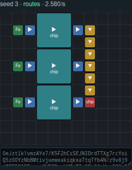

# Seeing the factory: viewer, blueprint, mod, or RCON

Issue #9 asks for a way to see what is being trained and whether the model
infers well, and asks which of three paths is best: **Factorio RCON**, a **mini
Factorio mod**, or **just a webui** — noting that the first two would also
validate the simulator, and that convenience matters most ("главное чтобы было
максимально удобно").

The short answer: they are not competitors. They answer three different
questions, and the reference repository ([beyarkay/factorion]) ships all three
for exactly that reason. This document says which we built now, why, and what
would have to be true before we build the rest.

[beyarkay/factorion]: https://github.com/beyarkay/factorion

## What the reference actually does

Worth checking rather than assuming, because the answer is not the one you would
guess from the README:

| Path | Where | What it is for | In CI? |
| --- | --- | --- | --- |
| Web UI | `scripts/factory_builder.py`, 1661 lines | The only thing a human uses to look at model output | No |
| Blueprint **import** | `blueprint2world` + 34 `lesson_blueprints/*.txt` | Ground-truth ingest: hand-built factories become training tasks | **Yes** |
| Mod + RCON | `factorion-mod/`, 21 files | In-game demo, and engine-parity checks of the simulator | No |

Three facts from that table drove our decision.

**The UI carries the human-judgement job alone.** `factory_builder.py` contains
the string `blueprint` zero times. Their viewer and their blueprint code do not
touch each other. A blueprint string is not a viewer — you cannot look at
base64, and the round trip through the game costs a licensed install, a running
Factorio, and a human alt-tabbing per sample. So the claim "the blueprint is the
real view, everything else is a convenience" is wrong, and their own most-cited
PRs (#85, #86, #100) are UI work.

**The mod is deliberately not in CI, and this is not an oversight.** Their mod
README explains the constraint: *"Factorio's modding Lua has no file-read API and
no socket access — the sandbox is intentional for multiplayer determinism. The
only inbound channel for an external process is RCON."* RCON is not a design
choice they made over alternatives; it is the only door. The cost is a licensed
install, `config.ini` edits, and a quit-to-menu for every Lua change. It cannot
gate a pull request.

**Blueprint import is the cheapest validation per line.** It needs no game
running, no RCON, no account — just a string a human copied out of Factorio
once. It is the only one of the three that runs on every commit.

## What we built now

**An SVG viewer** ([`src/viewer.rs`](../src/viewer.rs)), embedded in the sample
report and in a standalone gallery:

```
cargo run --release --example gallery      # what the model is trained on
cargo run --release --bin sample -- --ckpt checkpoints/denoiser
```



Green sources, blue inserters, teal 3×3 assemblers with their recipe, yellow
belts, red sink. Before this, the report drew a factory as `A` with eight `a`
around it. That is a good debugger and a poor viewer: it cannot show you that a
machine is a 3×3 block, that two inserters face into it, or that a belt lane runs
past without ever touching it — which are exactly the questions a human asks when
they want to know whether a factory is any good.

It was chosen over the other two because of what it costs and what it blocks:

- **It is the only option that works with no Factorio.** CI has no licence. So do
  most people reading a training report.
- **It is offline, dependency-free text.** SVG embeds straight into the reports
  we already write (`docs/OBSERVABILITY.md`), with no network, no build step and
  no account. Every entity carries a `<title>`, so hovering says what the model
  actually committed there.
- **It renders from `Entity::footprint`** — the same table `blueprint.rs` exports
  from and `world.rs` validates against. A viewer with its own idea of size would
  reintroduce the bug it exists to make visible.

The gallery prints a **blueprint string under every factory**, so the escape
hatch to the real game stays one paste away without anyone installing anything.

## Why not the mod / RCON yet

Not "never" — **not yet**, and there is a specific trigger.

The honest argument for the mod is not the demo, it is *parity*: it is the only
way to learn that our simulator is lying. The reference's own README concedes the
gap: *"Instead of integrating directly with the game (which would be
prohibitively slow for training), this project uses a basic implementation of
core Factorio mechanics."* When they measured, belts, splitters and undergrounds
came out exact, while **assemblers over-counted** (crafting time), **long-handed
inserters** read 0.86 against roughly 1.23, and flat inserters ran about 8% under.

That is a real finding and it lands on us: our `throughput.rs` uses the same
`INSERTER_RATE = 0.86` and the same simplified assembler model. But note what it
implies. Parity matters when you are about to trust a *number*. Mostly we do not
yet — the same 30 bank tasks admit 3 answers each, and the model is scored on a
simulator whose *ranking*, not whose absolute rate, is what selects between them.
Buying engine parity today would cost a licensed install and a non-CI-able test
to sharpen a figure that little yet depends on.

`CIRCUIT_LINE` is the first place that "little" is not "nothing", and it is worth
being exact about how far it goes. Its lesson — the second cable feed doubles the
factory, the third adds nothing — is a claim about where a *cap* sits, and caps
are exactly where an invented rate can bite.

What is robust is the **plateau**: the cable machine can never emit more than two
inserters carry, so a third feed is waste at any rate. What is *not* robust is the
`2.0×`. At `R = 0.86` the machine is input-capped at `R` crafts/s and yields 2
cable per craft, so it emits `2R` and two inserters carry exactly `2R` — the rate
cancels and the second feed is worth 2.0×. That cancellation only holds while
`R ≤ 1.0`, the machine's own crafting cap. At a long-handed `1.23/s` the crafting
speed binds first: the machine emits 2.0 cable/s, one feed carries 1.23, and the
second feed is worth **1.63×**, not 2.0×.

So the ranking survives and parity still waits. But "the absolute rate does not
matter, only the ordering" is no longer free — it is now a property to re-check
per family rather than assume, and the next lesson that encodes a cap may not
cancel so cleanly.

**Build it when we first distrust a specific throughput number** — when a
best-of-N run picks a layout a human can see is worse, or when the model starts
exploiting a rate we invented. That is the point where parity pays for itself,
and the reference's parity table tells us where to look first (assemblers and
inserters, not belts).

## What comes before it

Blueprint **import**, the reference's third path, is the one we do not have and
should want, and it is worth more than the mod at a fraction of the cost:

- It is the ground-truth direction. Our exporter is currently checked against our
  own schema and our own simulator — that is our convention read back to us. The
  footprint bug survived exactly that kind of self-agreement, and the inserter
  direction convention nearly did too (see `tests/blueprint_export.rs`).
- A human pastes a factory out of the real game *once*, and it validates forever
  in CI with no game running.
- It also feeds training: hand-built factories become tasks, which is what the
  reference's 34 `lesson_blueprints/*.txt` are.

The order, then: **viewer now** (done), **blueprint import next**, **mod/RCON
when a number is in dispute**.
